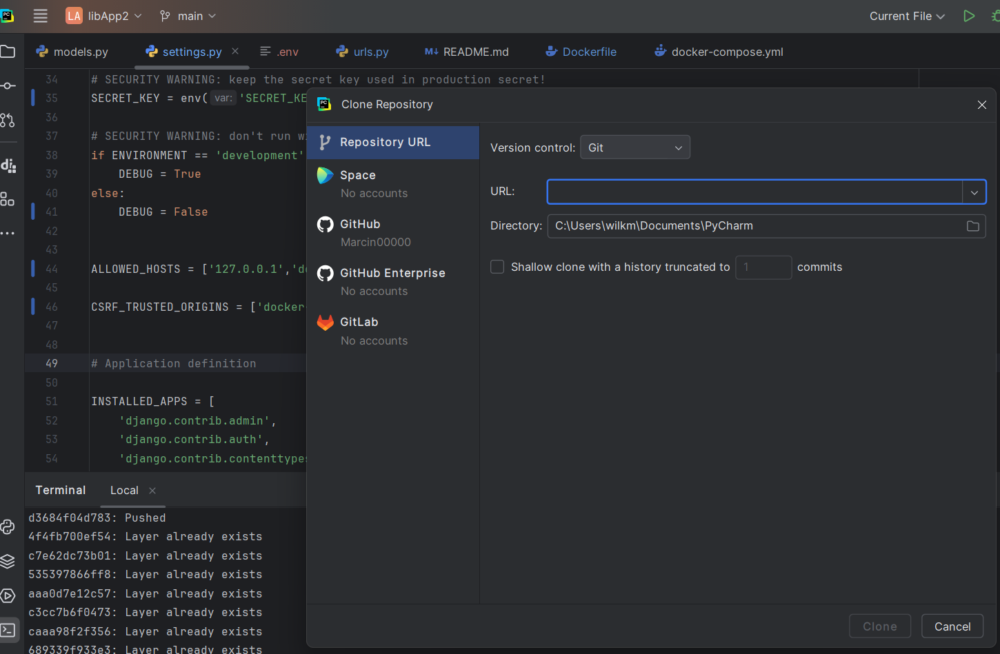
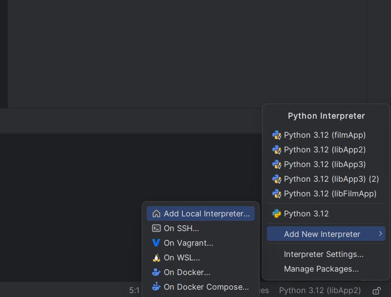
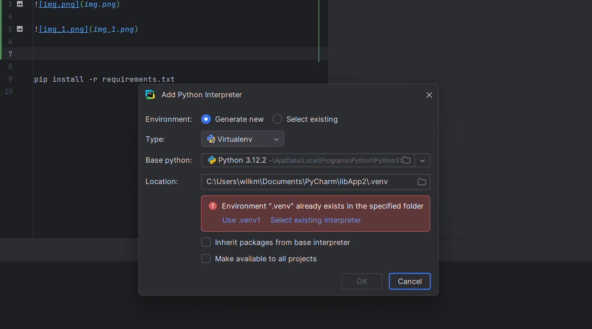
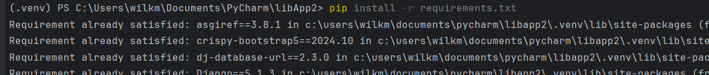
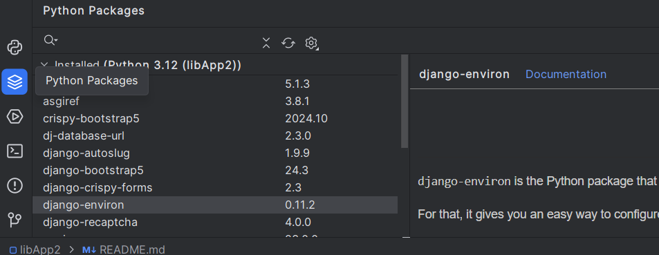
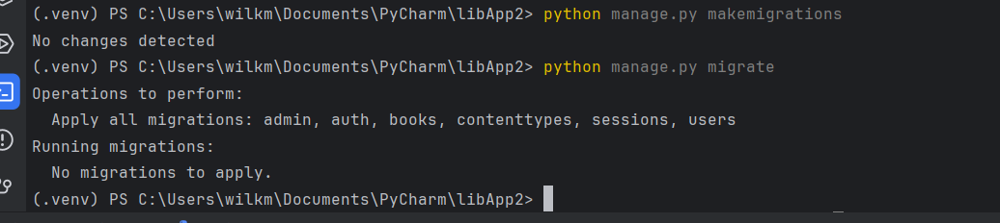
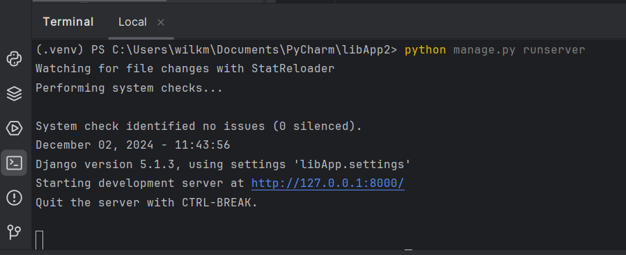
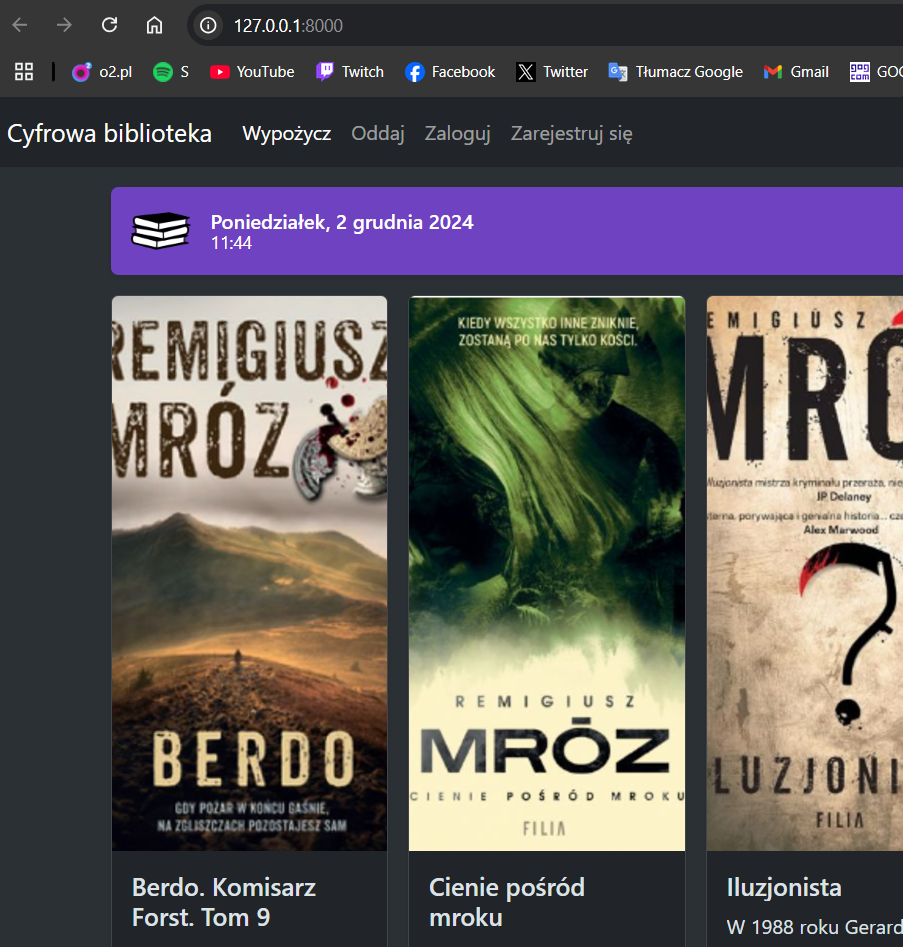
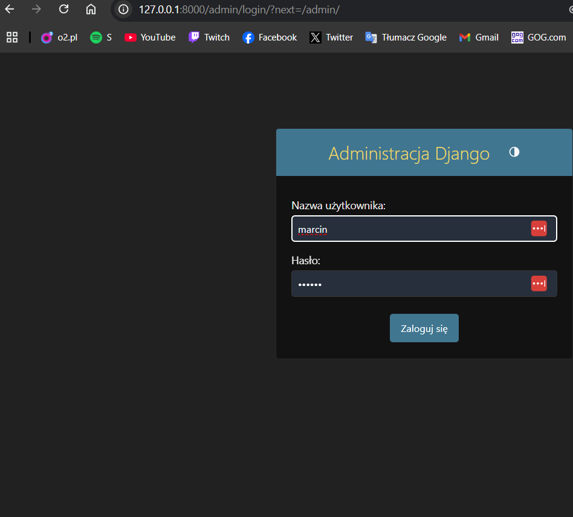
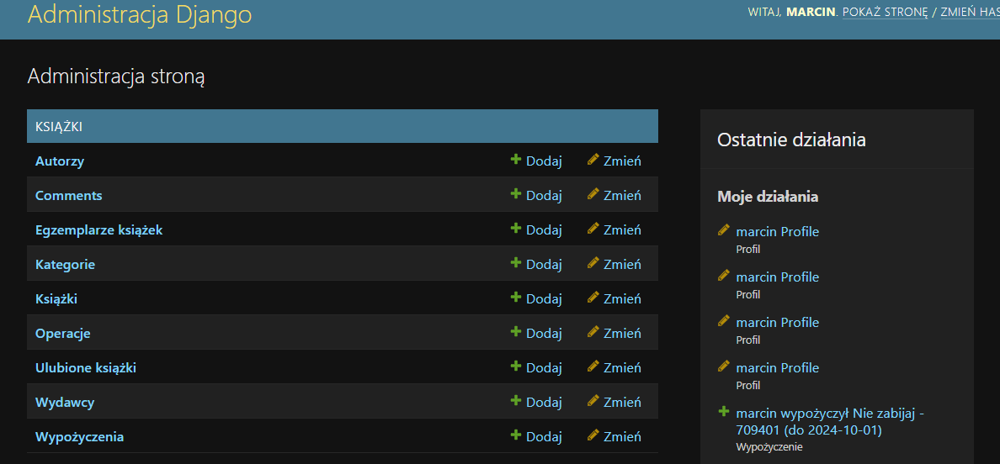

Aplikacja Biblioteka

.venv w terminalu ^

pip install -r requirements.txt

python manage.py makemigration
python manage.py migrate

python manage.py runserver  

pod urlStrony/admin jest panel admina konto tworzy polecenie:
python manage.py createsuperuser

tutorial docker + django, 4 odcinki
https://www.youtube.com/watch?v=M3hHKRoRBzw&ab_channel=AndreasJud

strona na "pociągu" 2 usługi zhostwane
https://docker-production-c556.up.railway.app/

miłej zabawy 
